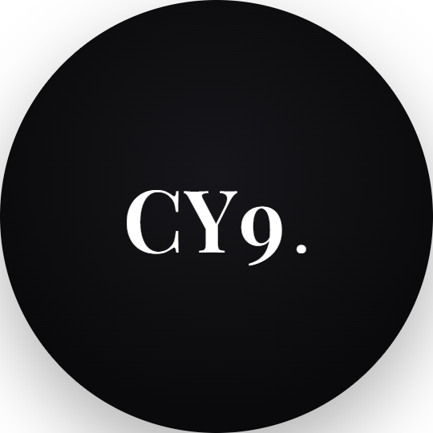

# ⚡ CY9 — Autonomous AI Executive & Holographic Desktop OS

<div align="center">
  
  <h3>CY9 TACTICAL INTELLIGENCE // SYSTEM CORE</h3>
  <p>المساعد الذكي المستقل وفائق القدرات لنظام ويندوز مع تحكم ذاتي كامل، أصوات طبيعية، وتكامل ذكي للأجهزة</p>
</div>

---

## 🌟 نظرة عامة (Overview)

**CY9** هو مساعد ذكاء اصطناعي تكتيكي ومستقل لسطح المكتب في نظام **Windows**، مبني على أحدث معمارية **Google Gemini AI**، ومزود بمحرك أصوات بشرية طبيعية، وكاميرا للتعرف على الوجه، وتحكم ذاتي كامل بالماوس والكتابة، ودائرة عائمة هولوغرافية تفاعلية.

---

## 🚀 القدرات والأنظمة الخارقة (Superpowers Suite)

### 1. 🎙️ محرك الأصوات النيورالية الطبيعية (Neural Voice Studio)
- **أصوات عربية وبشرية فائقة الواقعية**:
  - 🇸🇦 **حامد (Hamed Neural)**: نبرة سعودية وقورة ورسمية وفخمة.
  - 🇸🇦 **زارية (Zariyah Neural)**: صوت نسائي سعودي طبيعي وسلس.
  - 🇦🇪 **حمدان (Hamdan Neural)**: صوت إماراتي هادئ وواضح.
  - 🇪🇬 **شاكر (Shakir Neural)**: متحدث مصري لبق.
  - 🇬🇧 **Ryan Neural**: صوت المساعد الذكي البريطاني.
- **الترحيب الصوتي التلقائي**: ينطق CY9 فور فتح البرنامج عبارة: *"هلا ومرحبا يا CY9"*.
- **المقاطعة الفورية والكتم**: إمكانية إيقاف صوت CY9 فوراً أثناء حديثه بالضغط على زر **`ESC`** أو **`Space`** أو النقر على زر **`🛑 STOP SPEECH`** أو بالمقاطعة الصوتية (*"اسكت"* / *"Stop"*).

### 2. 🤖 العميل الذاتي للتحكم بالشاشة والماوس (Autonomous Desktop Agent)
- **الرؤية والتحكم في سطح المكتب**:
  - التقاط الشاشة وتحليل العناصر البرمجية والنوافذ النشطة.
  - تحريك مؤشر الماوس والنقر التلقائي وإدخال النصوص في أي برنامج عبر (`SendKeys` & `Mouse Event`).
  - تنفيذ مهام مركبة مثل: تنظيم الملفات المبعثرة، والبحث المعمق، وإعداد التقارير وحفظها على سطح المكتب.

### 3. 👁️ التعرف بالوجه عبر الكاميرا والحماية الصحية (Face ID & Health Guard)
- **التعرف البيومتري على الحضور**:
  - مراقبة حضور المستخدم عبر الكاميرا والترحيب الصوتي التلقائي عند الجلوس: *"أهلاً وسهلاً بعودتك يا سيدي، تم التحقق من هويتك بنجاح"*.
- **مراقب الجلسة والاستقامة**:
  - فحص استقامة الظهر وتقديم نصائح مريحة، مع تفعيل تنبيهات استراحة العينين (قاعدة 20-20-20).

### 4. 📱 مركز التكاملات الحقيقية (Connected Ecosystem)
- **مشغل موسيقى التركيز (Spotify & Focus Audio Deck)**:
  - تشغيل قوائم التركيز والبحث عن الأغاني والتحكم الكامل بالوسائط.
- **واتساب وتيليجرام (WhatsApp Web & Telegram)**:
  - إطلاق سريع لمحادثات واتساب ويب وإرسال المذكرات والإشعارات الفورية إلى هاتفك عبر تيليجرام.
- **التقويم اليومي (Daily Agenda)**:
  - استعراض المواعيد اليومية، والمهام المعلقة، وقراءة التقرير الصباحي المتكامل.

### 5. 🏠 مركز التحكم في المنزل والشاشات الذكية (Smart Home & TV Commander)
- **ريموت الشاشات الذكية (Smart TV Remote)**:
  - التحكم في شاشات Samsung و LG و Android TV (تشغيل/إطفاء، رفع وخفض وكتم الصوت، وفتح YouTube و Netflix بلمسة واحدة).
- **أجهزة الغرفة والمقابس الذكية (IoT Plugs & Lights)**:
  - التحكم في أجهزة الغرفة وإضاءة الهولوجرام مع مراقبة استهلاك الطاقة اللحظي.

### 6. 🌀 الدائرة العائمة التفاعلية والتشغيل مع إقلاع الجهاز (Floating Orb & Autostart)
- **الدائرة العائمة على سطح المكتب (Floating Widget)**:
  - دائرة هولوغرافية عائمة فوق كافة التطبيقات تحمل شعار **CY9** وأمواج الطاقة الدائرية.
  - قائمة كليك يمين متكاملة (Windows Native Context Menu) لاستدعاء التطبيق، تشغيل المايك، أو الإغلاق التام.
- **التشغيل التلقائي مع فتح الجهاز**:
  - يعمل CY9 تلقائياً في الخلفية مع إقلاع الويندوز ويتحول للدائرة العائمة فور التصغير.

---

## ⌨️ اختصارات لوحة المفاتيح التكتيكية (Keybindings)

| الاختصار | الوظيفة |
| :--- | :--- |
| **`Ctrl + Shift + J`** | إظهار / إخفاء واجهة CY9 الرئيسية فوراً |
| **`Escape (ESC)`** | إيقاف وإسكات صوت CY9 فوراً أثناء الحديث |
| **`Space (المسافة)`** | إيقاف صوت CY9 (خارج حقول الكتابة) |
| **`Ctrl + Shift + Q`** | إغلاق تطبيق CY9 وجميع عملياته في الخلفية نهائياً |

---

## 🛠️ التثبيت والتشغيل (Installation & Quick Start)

### المتطلبات:
- نظام تشغيل **Windows 10 / 11**
- [Node.js](https://nodejs.org/) (الإصدار 18 أو أحدث)
- مفتاح Google Gemini API Key من [Google AI Studio](https://aistudio.google.com/) *(اختياري للأوامر المحلية؛ مطلوب للذكاء الاصطناعي الكامل والرؤية)*

### طريقة التشغيل السريع:

```powershell
# 1. الدخول إلى مجلد المشروع
cd c:\Users\ahq37\OneDrive\Desktop\CY9-AI-ASSEST-WIN

# 2. تشغيل التطبيق في وضع التطوير
npm start
```

### إنشاء اختصار سطح المكتب الرسمي:
- اضغط مرتين على ملف `انشاء_اختصار_سطح_المكتب.bat` أو من داخل التطبيق في الإعدادات اضغط **`⚡ إنشاء اختصار سطح المكتب`**.

---

## 📂 الهيكلية البرمجية (Project Architecture)

```
CY9-AI-ASSEST-WIN/
├── CY9.png                     # شعار CY9 الرسمي عالي الدقة
├── CY9.ico                     # أيقونة الويندوز الرسمية
├── main.js                     # Electron main process، إدارة النوافذ والدائرة العائمة
├── preload.js                  # جسر الأمان والتكامل بين Node وواجهة المستخدم
├── package.json                # إعدادات الحزمة والمكتبات (@google/genai, electron)
├── create_shortcut.vbs         # سكريبت توليد اختصار سطح المكتب الرسمي
├── dist/                       # حزمة التطبيق التنفيذي المستقل (CY9.exe)
├── src/
│   ├── index.html              # الواجهة الرئيسية والهولوغرافية لنظام CY9
│   ├── widget.html             # واجهة الدائرة العائمة لسطح المكتب
│   ├── styles/
│   │   ├── hud.css             # تصميم الألوان Obsidian Noir والهولوجرام
│   │   └── widget.css          # تنسيق وتوهج الدائرة العائمة
│   ├── renderer/
│   │   ├── app.js              # المتحكم الرئيسي في الواجهات والأحداث
│   │   ├── arcReactor.js       # محرك المفاعل الدائري (60 FPS HTML5 Canvas)
│   │   ├── voiceEngine.js      # محرك التعرف الصوتي العربي والإنجليزي
│   │   ├── widgetRenderer.js   # محرك رسومات الدائرة العائمة التفاعلية
│   │   ├── audioFX.js          # المؤثرات الصوتية التكتيكية البرمجية
│   │   ├── gestureEngine.js    # محرك الإيماءات التفاعلية
│   │   └── meetingEngine.js    # محرك تلخيص الاجتماعات والملاحظات
│   └── services/
│       ├── geminiService.js    # عميل Gemini AI ومحرك استدعاء الأدوات البرمجية
│       ├── neuralVoiceService.js# محرك الأصوات النيورالية الطبيعية
│       ├── faceVisionService.js # محرك الكاميرا والتعرف على الوجه والصحة
│       ├── visionAgentService.js# محرك التحكم الذاتي في الماوس والشاشة
│       ├── integrationsService.js# مشغل Spotify وواتساب وتيليجرام والتقويم
│       ├── smartHomeService.js # ريموت التلفزيون والأجهزة الذكية
│       ├── agentManager.js     # منسق سرب الوكلاء الذكية
│       ├── systemService.js    # فحص العتاد والتقاط الشاشة والتحكم بالصوت
│       └── memoryService.js    # الذاكرة طويلة المدى والإعدادات (~/.cy9/)
```

---

## 🔒 الأمان والخصوصية (Privacy & Security)
- تبقى جميع الإعدادات والذكريات والمهام مخزنة محلياً بالكامل على جهازك في `~/.cy9/cy9_data.json`.
- الأوامر الحرجة تخضع لبروتوكول الاستئذان والتأكيد قبل التنفيذ.

---

<div align="center">
  <b>CY9 CORE // SYSTEM FULLY OPERATIONAL</b>
</div>
